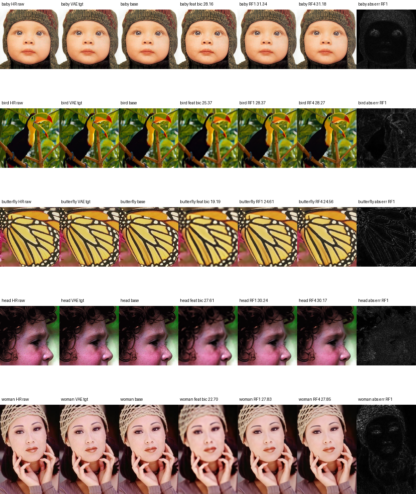
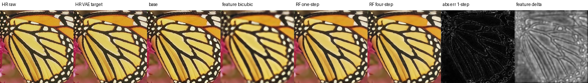

# Decoder Feature Flow SR

**One-step rectified flow in a frozen VAE decoder feature space for x2 super-resolution.**

This repository packages an overnight experiment that asks a narrow question:

> Can we learn a vector field inside an intermediate VAE decoder feature space
> that transports bicubic-upsampled LR decoder features toward HR decoder
> features, then use that field in one step at inference?

The short answer from this run is **yes, at the selected decoder cut `f3`
(`decoder.up_blocks.1`) the learned vector field clearly improves over feature
bicubic, and the one-step result is close to or slightly better than four-step
Euler on PSNR/L1**.

This is not a diffusion-UNet SR method. It does not use a pretrained denoising
UNet, does not call `scheduler.add_noise()`, and does not feed decoder features
into SDXL, SD2.1, or FLUX denoisers. The learned module is a lightweight vector
field trained directly in decoder feature space.



## What Problem Is This Solving?

Many latent SR systems upscale the latent tensor itself or apply a deterministic
feature projector. Here we test a different object: a **transport field** between
two frozen VAE decoder feature distributions.

Given a high-resolution image crop `x_HR`, we construct a low-resolution image
`x_LR` by bicubic downsampling. A frozen FLUX VAE encoder `E` maps both images
into latent space, and the frozen decoder `D` is split at an internal cut `k`:

```text
D = D_>k o D_<=k
```

For a selected decoder feature cut:

```text
f_H = D_<=k(E(x_HR))
f_L = D_<=k(E(x_LR))
f_B = Bicubic(f_L, spatial_size=f_H)
```

The model learns a vector field `v_theta` that moves `f_B` toward `f_H`.
The pixel target is the VAE reconstruction `x_H_rec = D_>k(f_H)`, not raw HR.
That keeps the objective on the frozen VAE decoder manifold.

## Rectified-Flow Formulation

For each feature pair `(f_B, f_H)`, define:

```text
f_0 = f_B
f_1 = f_H
sigma(t) = sigma_max * t * (1 - t)
f_t = (1 - t) * f_0 + t * f_1 + sigma(t) * eps
```

The model is trained with flow matching:

```text
v_theta(f_t, t, cond=f_0) ~= f_1 - f_0
```

At inference, the main path is one-step Euler:

```text
f_hat = f_B + v_theta(f_B, t=0, cond=f_B)
x_hat = D_>k(f_hat)
```

We also evaluate two-step/four-step Euler and stochastic one-step variants for
diagnostics.

## Method Summary

- Frozen VAE: `black-forest-labs/FLUX.1-dev`, `vae` subfolder.
- Decoder split candidates: `f1` to `f5`.
- Selected cut: `f3`, mapped to `decoder.up_blocks.1`.
- Model: lightweight residual convolutional feature vector field with sinusoidal
  time embedding and optional gate.
- Main signal: rectified-flow vector matching over random `t`.
- Auxiliary signals: endpoint feature loss, FFT loss, one-step feature loss,
  decoded RGB loss, low-frequency anchor, high-frequency loss, drift control,
  and gate regularization.

The core training script is:

```text
scripts/train_feature_rectified_flow_sr.py
```

## Data Used

Training:

- DIV2K train HR
- Local path used in this run:
  `/home/juhwan/Documents/sr/BasicSR/datasets/DIV2K/DIV2K_train_HR`
- Scale: x2
- HR crop size: 512
- LR construction: bicubic downsampling from HR crop

Validation/evaluation:

- Set5
- Set14
- B100
- Urban100

Metrics in this repository are primarily reported against the FLUX VAE
reconstruction target `x_H_rec`. Raw-HR metrics are also logged in the raw CSVs,
but VAE-target metrics are the cleaner measurement for this experiment because
the model is explicitly asked to move along the frozen decoder feature manifold.

## Cut Probe

The experiment first probed decoder cuts `f1` to `f5` on 32 DIV2K images.
The selection score preferred a cut that had non-trivial feature/high-frequency
gap, stable decoded pixels, moderate decoder sensitivity, and feasible runtime.

| Cut | Decoder Stage | Score | RGB L1 | HF Error | FFT Gap | Sensitivity | Probe VRAM |
|---|---:|---:|---:|---:|---:|---:|---:|
| f3 | up_blocks.1 | 0.4707 | 0.09968 | 0.07354 | 2.13634 | 0.14372 | 1.083 GiB |
| f4 | up_blocks.2 | 0.4315 | 0.06940 | 0.04755 | 3.77468 | 0.03831 | 1.721 GiB |
| f2 | up_blocks.0 | 0.0014 | 0.12887 | 0.08451 | 0.63098 | 0.30649 | 0.864 GiB |
| f1 | conv_in | -0.5271 | 0.17867 | 0.08729 | 0.52488 | 0.42026 | 0.802 GiB |
| f5 | conv_act | -0.7000 | 0.07063 | 0.04542 | 0.03181 | 0.48919 | 0.955 GiB |

`f3` was selected. `f4` was the second-best probe cut, but the default training
configuration OOMed at 512 due to the large feature tensor
`1 x 256 x 512 x 512`. A reduced f4 run would need smaller hidden width,
fewer blocks, lower HR size, lower pixel-loss frequency, or feature tiling.

## Overnight Run

Hardware:

- GPU: NVIDIA RTX 3090 24 GB
- Precision: bf16
- Batch size: 1
- Gradient accumulation: 8
- Hidden channels: 128
- Blocks: 8
- Gate: enabled
- `sigma_max`: 0.03

Training budget and progress:

| Phase | Steps | Wall-clock |
|---|---:|---:|
| f3 warm-up | 0 -> 2000 | 3.26 h |
| f3 main resume | 2000 -> 6063 | 6.72 h |
| Total f3 updates | 6063 optimizer steps | ~9.98 h |

The final main run stopped by time budget at step 6063, saved checkpoints, ran
final validation, and synced W&B.

W&B run:

```text
https://wandb.ai/standard_juhwan/feature-rectified-flow-sr/runs/sc1t0349
```

## Results

The important morning comparison was:

```text
feature bicubic vs RF one-step vs RF four-step
```

All values below are VAE-target metrics.

| Dataset | Method | PSNR | SSIM | RGB L1 | LPIPS |
|---|---|---:|---:|---:|---:|
| Set5 | feature bicubic | 24.606 | 0.6974 | 0.07898 | 0.15612 |
| Set5 | RF one-step | 28.478 | 0.8301 | 0.04984 | 0.07966 |
| Set5 | RF four-step | 28.406 | 0.8291 | 0.05026 | 0.07698 |
| Set14 | feature bicubic | 22.713 | 0.5895 | 0.09785 | 0.19393 |
| Set14 | RF one-step | 26.161 | 0.7321 | 0.06857 | 0.09724 |
| Set14 | RF four-step | 26.014 | 0.7315 | 0.06977 | 0.09133 |
| B100 | feature bicubic | 22.465 | 0.5442 | 0.10204 | 0.23221 |
| B100 | RF one-step | 25.516 | 0.6834 | 0.07373 | 0.14454 |
| B100 | RF four-step | 25.347 | 0.6820 | 0.07528 | 0.13285 |
| Urban100 | feature bicubic | 20.022 | 0.5595 | 0.12862 | - |
| Urban100 | RF one-step | 24.114 | 0.7488 | 0.08163 | - |
| Urban100 | RF four-step | 23.874 | 0.7484 | 0.08364 | - |

Observations:

- RF one-step improves strongly over feature bicubic on every benchmark.
- RF four-step also improves strongly over feature bicubic, which suggests the
  learned feature-space vector field is meaningful.
- One-step is very close to four-step, and is slightly better on PSNR/L1 in this
  run. Four-step tends to have slightly better LPIPS on some datasets.
- This supports the one-step compression hypothesis for this f3 cut.

## Visuals

Set5 butterfly final comparison:



Urban100 sample outputs are included as separate files, not as a huge panel:

```text
assets/urban100_samples/
  img001_vae_target.png
  img001_feature_bicubic.png
  img001_rf_1step.png
  img001_rf_4step.png
```

The full local Urban100 export from the run was stored outside this repo at:

```text
runs/feature_rectified_flow_x2_f3_resume_bench_wandb/train_main/benchmarks/Urban100_final_step_6063/
```

## Runtime

The learned vector field is not the main runtime bottleneck; the frozen FLUX VAE
decoder tail is larger.

| Method | Input -> Output | Total | Front/Encode | Vector/Model | Tail/Decode | Peak |
|---|---:|---:|---:|---:|---:|---:|
| DecoderFeatureFlowSR | 512 -> 1024 | 300.8 ms | 56.3 ms | 87.3 ms | 157.4 ms | 3.37 GiB |
| DecoderFeatureFlowSR | 1024 -> 2048 | 1.22 s | 240.5 ms | 347.4 ms | 634.8 ms | 12.96 GiB |
| LUA x2 | 512 -> 1024 | 421.1 ms | 31.3 ms | 140.6 ms | 249.3 ms | 2.79 GiB |
| LUA x2 | 1024 -> 2048 | 1.93 s | 132.5 ms | 605.6 ms | 1192.2 ms | 9.94 GiB |

For x2, this f3 one-step RF path is faster than the measured LUA x2 full
pipeline on the same machine. x4 is not directly compared here because this RF
experiment is x2. A separate x4 or tiled inference study is needed for fair
`1024 -> 4096` claims.

## Reproducing

Install dependencies:

```bash
pip install -r requirements.txt
```

Run the overnight f1-f5 auto-probe plus training:

```bash
bash configs/train_f3_x2_overnight.sh
```

The actual resumed main run used:

```bash
bash configs/resume_f3_main.sh
```

The script writes:

```text
probe/probe_metrics.csv
probe/probe_summary.json
probe/probe_visual_grid.png
train_main/summary.json
train_main/benchmark_log.csv
train_main/validation/*/comparison_grid.png
train_main/benchmarks/*_metrics.csv
train_main/checkpoints/*.pt
```

Checkpoints are intentionally ignored by git. Put them under `checkpoints/` or
`runs/` locally if you want to resume.

## Repository Contents

```text
scripts/train_feature_rectified_flow_sr.py  # main experiment script
configs/                                # runnable command templates
docs/                                   # formulation and experiment notes
assets/                                 # representative visual outputs
results/raw/                            # copied raw summaries and CSVs
results/tables/                         # compact human-readable tables
```

## Limitations

- This is an exploratory overnight experiment, not a SOTA SR model.
- Metrics are against a VAE reconstruction target, so they should not be mixed
  with classic raw-HR SR leaderboards without explanation.
- The model was trained at x2 and f3 only.
- f4 looked promising in probing but OOMed under the default 512/hidden-128
  setting.
- x4 and tiled 4096-output inference remain future work.

## Suggested Next Steps

1. Train a reduced f4 variant: `hr_size=384`, `hidden_channels=64/96`,
   `num_blocks=4`, `pixel_loss_every=4`.
2. Add tiled f3/f4 inference for 4096 outputs.
3. Compare x2 RF vs LUA vs SwinIR under a fixed raw-HR benchmark protocol.
4. Add a distilled one-step consistency term if a future four-step run beats
   one-step more clearly.
5. Save model cards/checkpoints through Git LFS or Hugging Face Hub if this is
   shared publicly.
