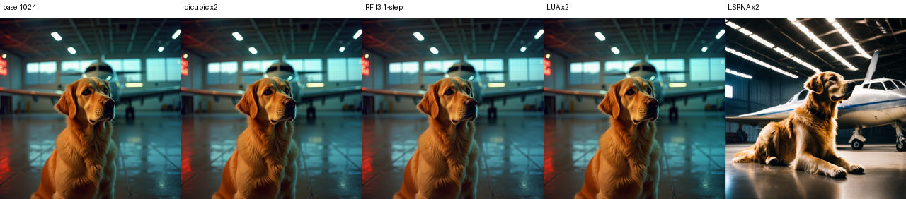

# Decoder Feature Flow SR

**One-step rectified flow in a frozen VAE decoder feature space for x2 super-resolution.**

This repository packages an overnight experiment that asks a narrow question:

> Can we learn a vector field inside an intermediate VAE decoder feature space
> that transports bicubic-upsampled LR decoder features toward HR decoder
> features, then use that field in one step at inference?

The short answer from this run is **yes, at the selected decoder cut `f3`
(`decoder.up_blocks.1`) the learned one-step vector field clearly improves over
feature bicubic, reaches the same rough x2 quality range as our local LUA
benchmark, and is well above the current LSRNA x2 snapshot in this workspace**.
Four-step Euler is kept only as a diagnostic check of the learned field, not as
the headline comparison.

This is not a diffusion-UNet SR method. It does not use a pretrained denoising
UNet, does not call `scheduler.add_noise()`, and does not feed decoder features
into SDXL, SD2.1, or FLUX denoisers. The learned module is a lightweight vector
field trained directly in decoder feature space.

## What Problem Is This Solving?

Many latent SR systems upscale the latent tensor itself or apply a deterministic
feature projector. Here we test a different object: a **transport field** between
two frozen VAE decoder feature distributions.

Given a high-resolution image crop `x_HR`, we construct a low-resolution image
`x_LR` by bicubic downsampling. A frozen FLUX VAE encoder `E` maps both images
into latent space, and the frozen decoder `D` is split at an internal cut `k`:

```text
D = D_>k o D_<=k
```

For a selected decoder feature cut:

```text
f_H = D_<=k(E(x_HR))
f_L = D_<=k(E(x_LR))
f_B = Bicubic(f_L, spatial_size=f_H)
```

The model learns a vector field `v_theta` that moves `f_B` toward `f_H`.
The pixel target is the VAE reconstruction `x_H_rec = D_>k(f_H)`, not raw HR.
That keeps the objective on the frozen VAE decoder manifold.

## Rectified-Flow Formulation

For each feature pair `(f_B, f_H)`, define:

```text
f_0 = f_B
f_1 = f_H
sigma(t) = sigma_max * t * (1 - t)
f_t = (1 - t) * f_0 + t * f_1 + sigma(t) * eps
```

The model is trained with flow matching:

```text
v_theta(f_t, t, cond=f_0) ~= f_1 - f_0
```

At inference, the main path is one-step Euler:

```text
f_hat = f_B + v_theta(f_B, t=0, cond=f_B)
x_hat = D_>k(f_hat)
```

We also recorded two-step/four-step Euler and stochastic one-step variants for
diagnostics, but the reported method is the one-step path above.

## Method Summary

- Frozen VAE: `black-forest-labs/FLUX.1-dev`, `vae` subfolder.
- Decoder split candidates: `f1` to `f5`.
- Selected cut: `f3`, mapped to `decoder.up_blocks.1`.
- Model: lightweight residual convolutional feature vector field with sinusoidal
  time embedding and optional gate.
- Main signal: rectified-flow vector matching over random `t`.
- Auxiliary signals: endpoint feature loss, FFT loss, one-step feature loss,
  decoded RGB loss, low-frequency anchor, high-frequency loss, drift control,
  and gate regularization.

The core training script is:

```text
scripts/train_feature_rectified_flow_sr.py
```

## Data Used

Training:

- DIV2K train HR
- Local path used in this run:
  `/home/juhwan/Documents/sr/BasicSR/datasets/DIV2K/DIV2K_train_HR`
- Scale: x2
- HR crop size: 512
- LR construction: bicubic downsampling from HR crop

Validation/evaluation:

- Set5
- Set14
- B100
- Urban100
- Manga109
- FLUX179 generated images

Metrics in this repository are reported in two ways:

- Primary experiment metrics compare to the FLUX VAE reconstruction target
  `x_H_rec`, because the model is explicitly trained to move along the frozen
  decoder feature manifold.
- Cross-method metrics compare to raw HR so the result can be read beside local
  LUA and LSRNA x2 benchmark summaries. Those numbers are useful context, but
  are not a strict leaderboard because the evaluators and VAE backbones differ.

## Cut Probe

The experiment first probed decoder cuts `f1` to `f5` on 32 DIV2K images.
The selection score preferred a cut that had non-trivial feature/high-frequency
gap, stable decoded pixels, moderate decoder sensitivity, and feasible runtime.

| Cut | Decoder Stage | Score | RGB L1 | HF Error | FFT Gap | Sensitivity | Probe VRAM |
|---|---:|---:|---:|---:|---:|---:|---:|
| f3 | up_blocks.1 | 0.4707 | 0.09968 | 0.07354 | 2.13634 | 0.14372 | 1.083 GiB |
| f4 | up_blocks.2 | 0.4315 | 0.06940 | 0.04755 | 3.77468 | 0.03831 | 1.721 GiB |
| f2 | up_blocks.0 | 0.0014 | 0.12887 | 0.08451 | 0.63098 | 0.30649 | 0.864 GiB |
| f1 | conv_in | -0.5271 | 0.17867 | 0.08729 | 0.52488 | 0.42026 | 0.802 GiB |
| f5 | conv_act | -0.7000 | 0.07063 | 0.04542 | 0.03181 | 0.48919 | 0.955 GiB |

`f3` was selected. `f4` was the second-best probe cut, but the default training
configuration OOMed at 512 due to the large feature tensor
`1 x 256 x 512 x 512`. A reduced f4 run would need smaller hidden width,
fewer blocks, lower HR size, lower pixel-loss frequency, or feature tiling.

## Overnight Run

Hardware:

- GPU: NVIDIA RTX 3090 24 GB
- Precision: bf16
- Batch size: 1
- Gradient accumulation: 8
- Hidden channels: 128
- Blocks: 8
- Gate: enabled
- `sigma_max`: 0.03

Training budget and progress:

| Phase | Steps | Wall-clock |
|---|---:|---:|
| f3 warm-up | 0 -> 2000 | 3.26 h |
| f3 main resume | 2000 -> 6063 | 6.72 h |
| Total f3 updates | 6063 optimizer steps | ~9.98 h |

The final main run stopped by time budget at step 6063, saved checkpoints, ran
final validation, and synced W&B.

W&B run:

```text
https://wandb.ai/standard_juhwan/feature-rectified-flow-sr/runs/sc1t0349
```

## Results

The main result is the one-step feature-space rectified flow. Four-step Euler is
not used as a headline baseline; it is saved separately in
`results/tables/diagnostic_four_step.csv`.

### Primary VAE-Target Result

These values measure the experiment on its intended target, the FLUX VAE
reconstruction `x_H_rec`.

| Dataset | Method | PSNR | SSIM | RGB L1 | LPIPS |
|---|---|---:|---:|---:|---:|
| Set5 | feature bicubic | 24.606 | 0.6974 | 0.07898 | 0.15612 |
| Set5 | RF one-step | 28.478 | 0.8301 | 0.04984 | 0.07966 |
| Set14 | feature bicubic | 22.713 | 0.5895 | 0.09785 | 0.19393 |
| Set14 | RF one-step | 26.161 | 0.7321 | 0.06857 | 0.09724 |
| B100 | feature bicubic | 22.465 | 0.5442 | 0.10204 | 0.23221 |
| B100 | RF one-step | 25.516 | 0.6834 | 0.07373 | 0.14454 |
| Urban100 | feature bicubic | 20.022 | 0.5595 | 0.12862 | - |
| Urban100 | RF one-step | 24.114 | 0.7488 | 0.08163 | - |
| Manga109 | feature bicubic | 21.679 | 0.6991 | 0.09224 | 0.07181 |
| Manga109 | RF one-step | 26.942 | 0.8508 | 0.05601 | 0.02019 |
| FLUX179 | feature bicubic | 27.209 | 0.8106 | 0.04595 | 0.07732 |
| FLUX179 | RF one-step | 30.964 | 0.8853 | 0.03075 | 0.02918 |

Observations:

- RF one-step improves strongly over feature bicubic on every benchmark.
- The gain is consistent across all local SR validation sets and the generated
  FLUX179 set.
- This supports the core hypothesis that a random-time rectified-flow objective
  can learn a useful one-step transport field at the f3 decoder cut.

### Contextual Comparison With LUA and LSRNA

The table below uses raw-HR RGB metrics so the result can be read beside the
local LUA/LSRNA benchmark files in this workspace. Interpret this as contextual:
our RF row comes from this f3 experiment's raw-HR logs, LUA is a FLUX VAE x2
benchmark with `crop_border=2`, and LSRNA is an SDXL VAE x2 benchmark.

| Dataset | Ours RF 1-step RGB PSNR/SSIM | LUA x2 RGB PSNR/SSIM | LSRNA x2 RGB PSNR/SSIM |
|---|---:|---:|---:|
| Set5 | 28.026 / 0.8138 | 27.988 / 0.8297 | 15.772 / 0.3903 |
| Set14 | 25.566 / 0.7058 | 26.085 / 0.7406 | 15.116 / 0.3744 |
| B100 | 25.284 / 0.6742 | 25.850 / 0.7142 | 15.325 / 0.3709 |
| Urban100 | 23.764 / 0.7381 | 24.985 / 0.7861 | 14.253 / 0.3965 |
| Manga109 | 26.549 / 0.8382 | 27.468 / 0.8647 | 15.385 / 0.5344 |

Takeaway:

- Against LUA, RF one-step is essentially tied on Set5 RGB PSNR, and trails by
  about 0.5 to 1.2 dB on Set14/B100/Urban100/Manga109.
- Against this LSRNA snapshot, RF one-step is much stronger on all listed
  datasets.
- A strict paper-style comparison should re-run RF, LUA, and LSRNA through one
  shared evaluator with the same crop border, color space, VAE backbone, and
  output saving path.

### Base Preservation and Detail

To test the actual desired behavior, we added a post-hoc evaluator that measures
whether the upsampled result still downscales back to the LR/base image while
adding controlled high-frequency content.

Macro average across Set5/Set14/B100/Urban100/Manga109:

| Method | Raw RGB PSNR | Raw RGB SSIM | Base L1 RGB | Base Grad L1 |
|---|---:|---:|---:|---:|
| RF one-step | 25.837 | 0.7540 | 0.0300 | 0.0767 |
| LUA x2 | 26.475 | 0.7871 | 0.0237 | 0.0155 |
| LSRNA x2 | 15.170 | 0.4133 | 0.1123 | 0.0671 |

For the generated FLUX179 images, we also ran RF in LR-only mode from a 1024px
base to a 2048px output, matching the existing LUA/LSRNA generated visual
comparison setup. On all 179 generated images:

| Method | Base PSNR RGB | Base SSIM RGB | Base L1 RGB | HF Gain vs Base |
|---|---:|---:|---:|---:|
| feature bicubic | 31.380 | 0.9048 | 0.01533 | 1.758 |
| RF one-step | 34.245 | 0.9460 | 0.01360 | 1.156 |

On the shared 5-image generated visual subset:

| Method | Base PSNR RGB | Base SSIM RGB | Base L1 RGB | HF Gain vs Bicubic |
|---|---:|---:|---:|---:|
| bicubic x2 | 41.937 | 0.9875 | 0.00426 | 1.000 |
| RF one-step | 33.784 | 0.9153 | 0.01378 | 1.285 |
| LUA x2 | 34.279 | 0.9185 | 0.01307 | 0.992 |
| LSRNA x2 | 9.673 | 0.3717 | 0.25925 | 1.609 |

This is the most relevant qualitative signal: RF is close to LUA in base
preservation on generated x2 samples, while increasing high-frequency energy
more than LUA. LSRNA has strong high-frequency change but poor base
preservation in this generated visual subset.

## Visuals

Representative images are committed under `assets/`. The Set5 butterfly grid is
a diagnostic artifact from the run and includes extra columns such as four-step
Euler and feature-delta maps; the main comparison in this README is the table
above against LUA and LSRNA.

Generated FLUX x2 comparison:



Urban100 sample outputs are included as separate files, not as a huge panel.

```text
assets/urban100_samples/
  img001_vae_target.png
  img001_feature_bicubic.png
  img001_rf_1step.png
```

The full local Urban100 export from the run was stored outside this repo at:

```text
runs/feature_rectified_flow_x2_f3_resume_bench_wandb/train_main/benchmarks/Urban100_final_step_6063/
```

## Runtime

The learned vector field is not the main runtime bottleneck; the frozen FLUX VAE
decoder tail is larger.

| Method | Input -> Output | Total | Front/Encode | Vector/Model | Tail/Decode | Peak |
|---|---:|---:|---:|---:|---:|---:|
| DecoderFeatureFlowSR | 512 -> 1024 | 300.8 ms | 56.3 ms | 87.3 ms | 157.4 ms | 3.37 GiB |
| DecoderFeatureFlowSR | 1024 -> 2048 | 1.22 s | 240.5 ms | 347.4 ms | 634.8 ms | 12.96 GiB |
| LUA x2 | 512 -> 1024 | 421.1 ms | 31.3 ms | 140.6 ms | 249.3 ms | 2.79 GiB |
| LUA x2 | 1024 -> 2048 | 1.93 s | 132.5 ms | 605.6 ms | 1192.2 ms | 9.94 GiB |

For x2, this f3 one-step RF path is faster than the measured LUA x2 full
pipeline on the same machine. x4 is not directly compared here because this RF
experiment is x2. A separate x4 or tiled inference study is needed for fair
`1024 -> 4096` claims.

## Reproducing

Install dependencies:

```bash
pip install -r requirements.txt
```

Run the overnight f1-f5 auto-probe plus training:

```bash
bash configs/train_f3_x2_overnight.sh
```

The actual resumed main run used:

```bash
bash configs/resume_f3_main.sh
```

Post-hoc base/detail evaluation:

```bash
python scripts/evaluate_base_detail_rf.py \
  --checkpoint runs/feature_rectified_flow_x2_f3_resume_bench_wandb/train_main/checkpoints/last.pt \
  --output_dir runs/feature_rectified_flow_x2_f3_base_detail_eval \
  --enable_gate \
  --paired_roots Set5=/path/to/Set5 Set14=/path/to/Set14 B100=/path/to/B100 Urban100=/path/to/Urban100 Manga109=/path/to/Manga109 \
  --generated_root /path/to/flux_random_1024_merged_179/images
```

The script writes:

```text
probe/probe_metrics.csv
probe/probe_summary.json
probe/probe_visual_grid.png
train_main/summary.json
train_main/benchmark_log.csv
train_main/validation/*/comparison_grid.png
train_main/benchmarks/*_metrics.csv
train_main/checkpoints/*.pt
```

Checkpoints are intentionally ignored by git. Put them under `checkpoints/` or
`runs/` locally if you want to resume.

## Repository Contents

```text
scripts/train_feature_rectified_flow_sr.py  # main experiment script
scripts/evaluate_base_detail_rf.py          # post-hoc base/detail evaluator
configs/                                # runnable command templates
docs/                                   # formulation and experiment notes
assets/                                 # representative visual outputs
results/raw/                            # copied raw summaries and CSVs
results/tables/                         # compact human-readable tables
```

## Limitations

- This is an exploratory overnight experiment, not a SOTA SR model.
- Metrics are against a VAE reconstruction target, so they should not be mixed
  with classic raw-HR SR leaderboards without explanation.
- The model was trained at x2 and f3 only.
- f4 looked promising in probing but OOMed under the default 512/hidden-128
  setting.
- x4 and tiled 4096-output inference remain future work.

## Suggested Next Steps

1. Train a reduced f4 variant: `hr_size=384`, `hidden_channels=64/96`,
   `num_blocks=4`, `pixel_loss_every=4`.
2. Add tiled f3/f4 inference for 4096 outputs.
3. Re-run x2 RF, LUA, and LSRNA under a fixed raw-HR benchmark protocol.
4. Add a stricter one-step consistency or distillation term only if diagnostic
   multi-step sampling starts to beat one-step clearly.
5. Save model cards/checkpoints through Git LFS or Hugging Face Hub if this is
   shared publicly.
